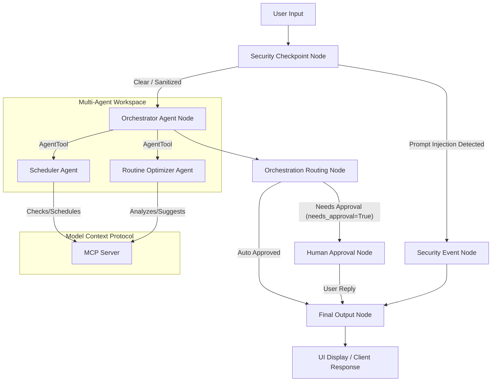

# CalmSchedule — Submission Writeup

## 1. Problem Statement

In today's fast-paced work environments, professionals suffer from meeting fatigue and cognitive overload. Research shows that continuous back-to-back video calls increase fatigue and reduce focus. While humans attempt to manage their calendars, they often neglect routine pacing, fail to insert breaks, and struggle to allocate dedicated slots for focus.

**CalmSchedule** solves this problem by acting as a smart, secure, and context-aware productivity concierge. It actively analyzes daily events, structures required mindfulness breaks, resolves calendar slots, and implements safety guardrails around calendar manipulation.

---

## 2. Solution Architecture

The graph flow is designed to ensure strict input sanitization, dynamic task delegation, and human confirmation before making modification updates.

---

## 3. Concepts Used & File References

* **ADK Workflow (Graph API)**: Orchestrates the multi-step execution.
  * *File reference*: [agent.py](file:///c:/Users/USER/Desktop/adk-workspace/calm-schedule/app/agent.py#L290-L303)
* **LlmAgent**: Model-driven nodes that execute reasoning tasks.
  * *File reference*: [agent.py](file:///c:/Users/USER/Desktop/adk-workspace/calm-schedule/app/agent.py#L77-L117)
* **AgentTool**: Enables the orchestrator agent to delegate subtasks to specialists.
  * *File reference*: [agent.py](file:///c:/Users/USER/Desktop/adk-workspace/calm-schedule/app/agent.py#L114)
* **MCP Server**: Implements the Model Context Protocol stdio transport to serve domain tools.
  * *File reference*: [mcp_server.py](file:///c:/Users/USER/Desktop/adk-workspace/calm-schedule/app/mcp_server.py)
* **Security Checkpoint**: Implements PII scrubbing, injection mitigation, and domain policies in a FunctionNode.
  * *File reference*: [agent.py](file:///c:/Users/USER/Desktop/adk-workspace/calm-schedule/app/agent.py#L125-L219)
* **Agents CLI**: Used for scaffolding and playground hosting.
  * *File reference*: [agents-cli-manifest.yaml](file:///c:/Users/USER/Desktop/adk-workspace/calm-schedule/agents-cli-manifest.yaml)

---

## 4. Security Design

* **PII Scrubbing**: Standard regex filters automatically replace Social Security Numbers, Credit Cards, email addresses, and phone numbers with redaction tags (e.g., `[REDACTED EMAIL]`). This protects user privacy by avoiding leaking contact details or numbers to external LLM providers.
* **Prompt Injection Detection**: Keyword-matching blocks common injection patterns (such as `"ignore previous instructions"`) and routes them to a dedicated failure path, protecting downstream prompts.
* **Structured JSON Audit Logs**: The checkpoint prints structured JSON telemetry to `sys.stderr` for every evaluation (e.g., matching SSNs or late-night policy violations) containing logs with appropriate severities (`INFO`, `WARNING`, `CRITICAL`).
* **Domain-Specific Rules**:
  1. **Confidential Content Policy**: Re-routes meetings mentioning `"confidential"` or `"restricted"` to require human approval.
  2. **Off-Hours Policy**: Re-routes scheduling requests outside standard business hours (08:00 - 18:00) to human review to prevent accidental late-night disruptions.

---

## 5. MCP Server Design

The local stdio MCP server exposes 4 tailored tools:
* **`get_calendar_events()`**: Retrieves current events to analyze daily cognitive load and time block availability.
* **`add_calendar_event(title, start_time, end_time)`**: Inserts events or break blocks into the simulation calendar database.
* **`optimize_routine_habits()`**: Provides guidelines and productivity optimization advice (such as limiting calls to 45 minutes).
* **`suggest_mindful_breaks(work_duration_minutes)`**: Resolves custom mindful actions depending on how long the user worked (e.g., rolling shoulders vs taking outdoor walks).

---

## 6. Human-in-the-Loop (HITL) Flow

A `RequestInput` node interrupts workflow execution and pauses when `needs_approval` is set to `True`.
This is critical for calendar updates and routine adjustments to ensure:
1. **Consent**: The assistant never commits changes or adds events without the user's explicit approval.
2. **Review**: The user can check slot overlaps and approve or deny the action dynamically in the UI.

---

## 7. Demo Walkthrough

1. **Scenario 1: Fetching Events** — Querying today's calendar calls `get_calendar_events` via the MCP server and shows pre-populated deep work blocks and sync meetings.
2. **Scenario 2: Adding a focus block** — Proposing a slot from 13:00 to 14:00 triggers a calendar edit. The workflow halts, prompts with a confirmation dialog, and finishes only once the user sends `yes`.
3. **Scenario 3: Security block** — Submitting a prompt injection string immediately halts the workflow, outputs a redacted security message, and prints a `CRITICAL` log to stderr.

---

## 8. Impact & Value Statement

CalmSchedule benefits remote workers, busy executives, and productivity-focused teams. It transforms calendars from static grids of meetings into active, balanced schedules that guard mental health, automate routine optimization, and guarantee calendar modifications are secure and user-approved.
